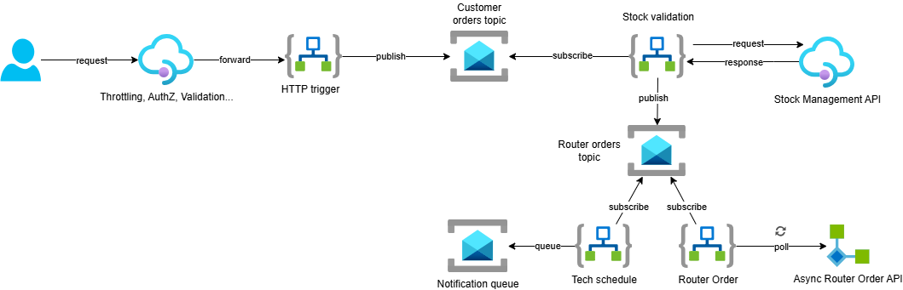
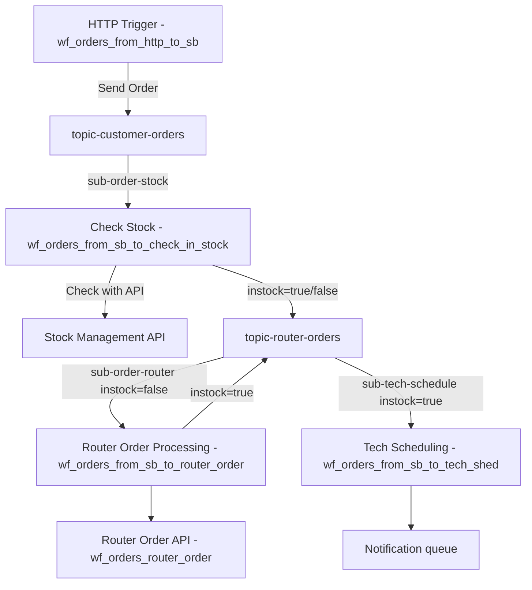

# Router Order - Azure Integration Services Solution

This project showcases an Azure Integration Services solution designed for a hypothetical scenario in which a customer places an order for an Internet router. The workflows manage customer requests, stock verification, router orders, and scheduling of technician interventions.

## Architecture



The solution includes several Logic App workflows:

- **wf_orders_from_http_to_sb**: Receives router orders in JSON format via HTTP (through APIM) and sends them to the Customer Order topic.
- **wf_orders_from_sb_to_check_in_stock**: Subscribes to Customer Order topic and calls an API (on APIM) to check if the router is in stock. XSLT transformation is applied and then, based on the response of the API call (default mocked response is "Not in Stock"), the workflow sets the custom property "instock" to `false` and publishes the message to the Router Order topic.
- **wf_orders_from_sb_to_router_order**: Subscribes to Router Order topic with a filter on custom property "instock" set to `false`, calls an asynchronous API to order a router, poll for the response and, if successful, publishes to the Router Order topic with custom property "instock" set to `true`.
- **wf_orders_router_order**: A mocked API that simulates a long-running task, such as provisioning a router, and returns an HTTP code 200 after a 1 minute delay.
- **wf_orders_from_sb_to_tech_shed**: Subscribes to Router Order topic custom property "instock" to `true` and queues a message in a notification queue. You can add a custom scheduling logic in between.



## Prerequisites

- [Azure Developer CLI](https://docs.microsoft.com/azure/developer/azure-developer-cli/install-azd)
- [.NET 6.0 SDK or later](https://dotnet.microsoft.com/download)
- [Azure subscription](https://azure.microsoft.com/free/)
- [Azure CLI](https://docs.microsoft.com/cli/azure/install-azure-cli)
- [PowerShell 7.0 or later](https://docs.microsoft.com/powershell/scripting/install/installing-powershell) (for Windows deployment)

## Deployment Steps

1. **Clone and Setup**
   ```bash
   git clone <repo-url>
   cd router-order
   ```

2. **Configure Environment (optional)**
   Set up the Azure Developer CLI environment variables:
   ```bash
   azd env new yourenvironmentname
   azd env set AZURE_SUBSCRIPTION_ID "your subscription GUID"
   azd env set AZURE_LOCATION "your Azure location"
   azd env set APIM_PUBLISHER_EMAIL "your.email@domain.com"
   azd env set APIM_PUBLISHER_NAME "Your Company Name"
   ```

3. **Login to Azure**
   ```bash
   az login
   azd auth login
   ```

4. **Deploy the Solution**
   ```bash
   azd up
   ```
   This command will:
   - Create a new resource group
   - Deploy all Azure resources using Bicep templates
   - Deploy and configure Logic App workflows
   - Set up Service Bus topics, subscriptions, and queues
   - Configure API Management
   - Set up necessary role assignments and permissions

5. **Verify Deployment**
   After deployment completes:
   - Check the Azure Portal to ensure all resources are created
   - Verify the Logic App workflows are running
   - Test the API endpoints through API Management

## Project Structure

- `/infra`: Bicep infrastructure-as-code templates
- `/logicapp`: Logic App implementation files
  - `/wf_*`: Logic App workflow definitions
  - `/Artifacts/Maps`: XSLT transformations for data mapping
  - `connections.json`: API connection definitions
- `/api`: API definitions and examples
- `/scripts`: Deployment and configuration scripts

## Clean Up

To remove all deployed resources:

```bash
azd down
```

This will delete:
- The resource group and all contained resources
- All deployed Logic Apps and their connections
- Service Bus namespace and all messaging entities
- API Management instance
- Storage accounts and their data

## Sample Data Disclaimer

The sample data provided in this repository (e.g., `sample_order.json`) is entirely fictional and was generated by AI. All personally identifiable information (PII) fields have been replaced with anonymized placeholders (e.g., `[FIRST_NAME]`, `[EMAIL]`). No real customer data is included in this project.

## Contributing

Contributions are welcome! Please feel free to submit a Pull Request.

## License

This project is licensed under the MIT License - see the LICENSE file for details.